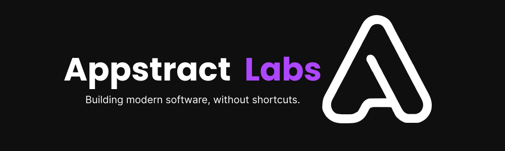

<div align="center"></div>
  

  # Appstract Labs – Landing Page

  **Building modern software without shortcuts.**
</div>

---

## 📖 Overview

This is the official landing page for **Appstract Labs**, a software agency focused on creating high-quality, modern, and tailored digital solutions for small and medium businesses.  
The landing showcases our services, values, and provides an entry point for potential clients.

---

## 🛠️ Tech Stack

- **[Next.js 15](https://nextjs.org/)** – React framework for server-side rendering and routing.
- **[React](https://react.dev/)** – Component-based UI library.
- **[TypeScript](https://www.typescriptlang.org/)** – Strongly-typed JavaScript.
- **[Tailwind CSS](https://tailwindcss.com/)** – Utility-first CSS framework.
- **[shadcn/ui](https://ui.shadcn.com/)** – Accessible and modern UI components.
- **[Lucide Icons](https://lucide.dev/)** – Beautiful open-source icons.
- **[Hero Icons](https://heroicons.com/)** – Beautiful hand-crafted SVG icons, by the makers of Tailwind CSS.
- **Vercel** – Deployment and hosting.
- **ESLint + Prettier** – Code quality and formatting.
---

## 🚀 Features

- Responsive design across desktop, tablet, and mobile.
- EN/ES language support.
- SEO-ready with `sitemap.xml` and `robots.txt`.
- Legal sections:
  - Privacy Policy  
  - Terms of Service  
  - Cookie Policy
- Clean and extensible folder structure.
- Optimized for performance and accessibility.

---

## 📂 Project Structure

```plaintext
landing/
├── app/                     # Next.js app directory
├── components/              # Reusable UI components
│   ├── atoms/               # Small, base components (buttons, inputs)
│   ├── forms/               # Form components (validated inputs, form layouts)
│   ├── layout/              # Layout elements (Navbar, Footer)
│   ├── molecules/           # Combined components (dialogs, cards, etc.)
│   ├── sections/            # Page sections (Hero, Services, Contact)
│   └── ui/                  # Shared UI primitives (modals, typography, etc.)
├── content/                 # Static content (footer links, services, data)
├── i18n/                    # Internationalization configuration
├── lib/                     # Utilities, helpers
├── messages/                # Translation files
│   ├── en.json
│   └── es.json
└── public/                  # Static assets
```

---

## ⚡ Getting Started

### Prerequisites
- Node.js >= 18
- pnpm, yarn, bun, or npm

### Installation
```bash
# Clone repository
git clone https://github.com/appstractlabs/landing.git
cd landing

# Install dependencies
pnpm install

# Run development server
pnpm dev

#Visit https://localhost:3000 in your browser.

pnpm build
pnpm start

```

### 📈 Deployment

This project is optimized for deployment on Vercel.
Simply push to your GitHub repository and import it in Vercel for automatic builds and previews.

### 📄 License

This project is licensed under the MIT License. See LICENSE for details.

<div align="center">
  Made with 💜 by <strong>Appstract Labs</strong>
</div>
